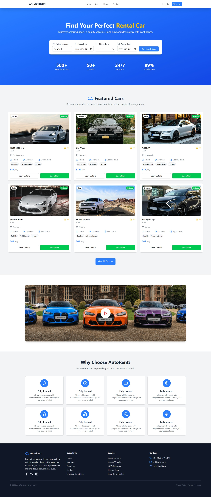

# 🚗 AutoRent - Car Rental Website



## Overview

**AutoRent** is a modern car rental website that allows users to find, browse, and book rental cars easily.  
It features a wide selection of vehicles, premium services, and detailed car information to ensure a smooth rental experience.

## Features

- Home page with featured cars and rental search.
- Browse cars by type: SUVs, Sedans, Luxury, Electric, and more.
- Car details including seats, transmission, fuel type, and additional features.
- Booking functionality (UI only).
- Information about insurance coverage and rental benefits.
- Contact section with location, email, and phone.
- Fully responsive design.

## Pages & Sections

1. **Home**
   - Welcome message: _"Find Your Perfect Rental Car"_
   - Car search form: Pickup location, date, and time.
   - Statistics: Premium cars, locations, support, satisfaction.
2. **Cars**
   - Featured cars with details and pricing per day.
   - View all cars option.
3. **About**
   - Company history and commitment to customers.
4. **Contact**
   - Address, phone, email, and contact form.
5. **Additional Sections**
   - Why Choose AutoRent
   - Fully Insured vehicles
   - Quick Links: Terms & Conditions, Services

## Installation

1. Download or clone the project:

```bash
git clone https://github.com/khalil97SQ/Car-Rental.git
```
